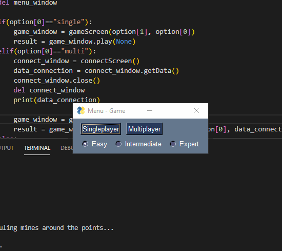

# :floppy_disk: Minesweeper V3
It's the version made in Python. This version is singleplayer and multiplayer and is played at a GUI(made with PySimpleGUI).

> How to use: Install Python and install PySimpleGUI: *pip install PySimpleGUI*, after that *python main.py*

## :speaker: About the game
In the game the player have to choose coordinates that he think don't have mines, so he could continue playing and solving the matrix.
The player have a possibility to put a flag at any coordinate to save the place of a bomb.
After cleaning all the matrix without selecting a mine you win.

## :clipboard: The ouput of the Matrix
The coordinates have a number that represents how many bombs there are near that point

- '' represent places that the player haven't selected yet

- '*' represent places that have mines(if you loose you can see them)

- 'B' represent flags placed by the player

## :running: Executing
You will have to choose the mode and the difficult of the game.

Right click of the mouse unlock a place in the matrix(and a number or a mine appear)

Left click of the mouse put a flag at a place in the matrix(and 'B' appear)

## :family: Multiplayer
After connecting to the server's ip or creating the game with your ip you can select the buttons to unlock. Be aware that if someone changes the matrix by clicking on a button you will have to click on Update Button.

**:v: Good game for you**
**:smiley: Good luck**